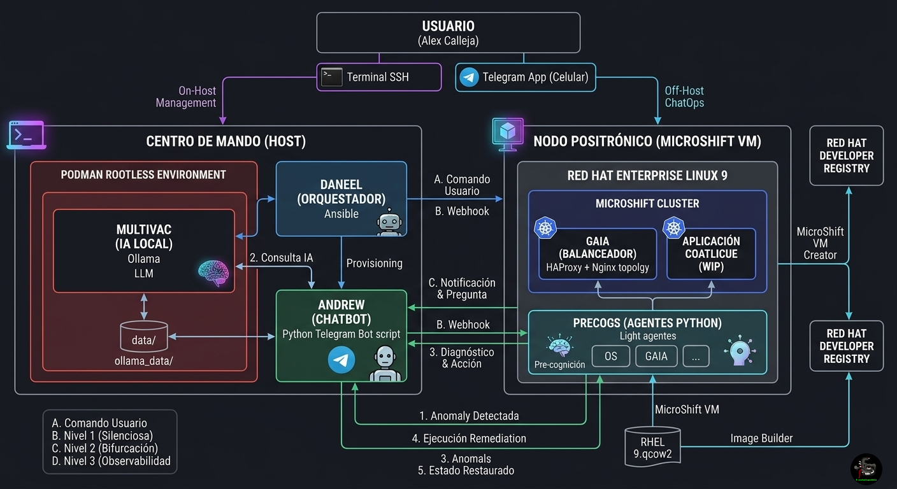

# 🐧🤖 ¿Sueñan los SysAdmins con pingüinos eléctricos?

**Tareas en Linux asistidas con IA (Soberanía y Automatización en el Edge)**

> *"The best Linux engineers will not be replaced by AI, they will be the ones who know how to use it effectively."*
>
> — Ezequiel Lanza & Eduardo Spotti

Repositorio oficial del proyecto y laboratorio abierto sobre la evolución de la administración de sistemas. Diseñado como una prueba de concepto itinerante para demostrar el paso de la automatización estática a la resolución dinámica con Inteligencia Artificial.

## 🚀 El Concepto

La administración de infraestructura genera toneladas de datos, logs y métricas. Enviar información sensible de servidores de producción a APIs de terceros (como OpenAI) suele violar las políticas de seguridad y cumplimiento.

Este proyecto demuestra que **la soberanía tecnológica es posible**. Montamos un asistente de IA 100% local, efímero y seguro utilizando contenedores *rootless*, orquestado enteramente con Ansible. Recordando la regla de oro: *la limpieza también es trabajo del sysadmin.*

## 🌌 Nomenclatura y Filosofía (Tributo a la Ciencia Ficción)

Este proyecto no solo explora el futuro de la infraestructura, sino que rinde homenaje a las obras fundacionales de la ciencia ficción que moldearon nuestra visión de la inteligencia artificial.

Dado que nuestro universo de herramientas ha crecido orgánicamente para cubrir desde la IA hasta el ChatOps, hemos documentado todo este *lore* en una sección dedicada.

📖 **[Conoce el origen de los nombres y la filosofía del proyecto aquí](docs/03-nomenclatura-filosofia.md)**

---

> 💡 **Manual de Operaciones:** Para comenzar a construir la infraestructura, desplegar a Multivac y orquestar el nodo Positrónico, consulta las instrucciones detalladas de despliegue en: **[`magrathea/README.md`](magrathea/README.md)**.

## 🏗️ Arquitectura del Laboratorio

1. **Multivac (IA Local):** Un modelo de lenguaje ligero (`qwen2.5-coder` o `llama3.2`) ejecutándose a través de **Ollama** dentro de un contenedor **Podman** sin privilegios. Cero basura en el host.
2. **Daneel (El Orquestador):** **Ansible** se encarga de crear el escenario, aprovisionar los servicios, y al finalizar, destruir todo rastro de la infraestructura.
3. **Gaia (El Balanceador):** Topología de proxy inverso y balanceo de carga (HAProxy + Nginx) desplegada sobre el clúster. Actúa como la entidad central que distribuye el tráfico y la carga de procesamiento de forma transparente hacia los nodos.
4. **Términus (La Base de Datos):** Un clúster de **PostgreSQL** desplegado nativamente como un *StatefulSet* dentro de MicroShift. Utiliza volúmenes lógicos (LVM) dedicados directamente en el disco del nodo físico para asegurar operaciones de I/O de alto rendimiento y garantizar la soberanía, aislamiento y persistencia absoluta de los datos en el Edge.
5. **Precogs (Los Agentes):** Agentes ligeros (escritos en **Python**) que monitorean la carga de servicios (como Nginx) o cambios en archivos críticos (como `/etc`). Al detectar anomalías, consultan a la IA local para determinar la mejor acción de remediación.
6. **Andrew (ChatOps):** Interfaz móvil implementada como un bot de Telegram. Actúa como el puente de comunicación: recibe las alertas de los **Precogs**, consulta a **Multivac** para obtener diagnósticos y te envía notificaciones asíncronas a tu teléfono. Permite la ejecución remota ("Zero-Touch") de tareas de remediación mediante simples comandos de chat.
7. **El Mulo (Chaos Engineering):** Un agente de asalto de carga pesada implementado con **Locust** en Python. Su función no es operativa, sino destructiva: simula escenarios de crisis inyectando cientos de miles de peticiones HTTP simultáneas hacia la Capa 1. Esto nos permite establecer una línea base de estrés (Baseline) para evaluar la resiliencia del stack tradicional ante cuellos de botella severos, descriptores de archivos saturados y fallas en cascada (`502/504 Bad Gateways`).

---

> 🛑 **Pruebas de Estrés:** Para colapsar el sistema bajo asedio, consulta las instrucciones detalladas del Chaos Engineering en: **[`chaos/README.md`](chaos/README.md)**.

## 🛠️ Requisitos Previos

### 💻 Host (Centro de Mando)

* Sistema Operativo: Fedora Linux (o distribución compatible).
* Podman instalado.
* Ansible y la colección de contenedores (`ansible-galaxy collection install containers.podman`).
* Al menos 8 GB - 16 GB de RAM disponibles en el sistema para la inferencia fluida de la IA.

### ☸️ MicroShift (Nodo Positrónico en KVM)

* Imagen Base: Red Hat Enterprise Linux (RHEL) 9 en formato `.qcow2` generada vía Image Builder.
* Recursos Asignados: Mínimo **2 vCPUs** y **8 GB de RAM** dedicados exclusivamente para la máquina virtual.
* Autenticación: Llaves SSH configuradas localmente y credenciales válidas de Red Hat Developers (Pull Secret y Activation Key).

### 👁️ Precogs (Monitoreo Predictivo y ChatOps)

* **Entorno Virtual (Python 3.x)**: El sistema nervioso comparte el entorno virtual (`venv`) configurado en la sección de Ingeniería del Caos.
* **Dependencias de Comunicación**: Requiere el paquete `pyTelegramBotAPI` instalado en el entorno virtual para la orquestación de mensajes.
* **Credenciales de Telegram**: Es indispensable contar con un Token de API (generado vía `@BotFather`) y un ID de usuario administrador para darle voz y seguridad a **Andrew**.

## 📜 Las Tres Leyes del SysAdmin

Inspiradas en las directivas asimovianas, la automatización y arquitectura de este laboratorio se rigen estrictamente por los siguientes principios operativos:

1. **Primera Ley:** Un SysAdmin debe respaldar TODO el sistema, y validar el respaldo regularmente.
2. **Segunda Ley:** Un SysAdmin debe dominar la línea de comandos, y evitar los gráficos, excepto si entra en conflicto con la Primera Ley.
3. **Tercera Ley:** Un SysAdmin debe automatizar al máximo, para tener tiempo libre productivo, hasta donde este tiempo libre no entre en conflicto con la Primera o la Segunda Ley.

---
*Nota Legal y de Derechos de Autor: Todos los nombres, términos y referencias literarias o cinematográficas utilizadas en este repositorio (Multivac, Daneel, Magrathea, PreCogs, Deckard, Operaciones Hail Mary, etc.) son propiedad de sus respectivos autores y titulares de derechos (Isaac Asimov, Philip K. Dick, Douglas Adams, Andy Weir, etc.). Su uso en este laboratorio es estrictamente con fines de homenaje cultural y educativos, sin fines de lucro.*

## 📜 Licencia y Contacto
Creado para la comunidad. Si rompes tu servidor de producción con esto, al menos la IA te explicará por qué falló.

---
👤 **Alex (@rootzilopochtli)** *Technical Training Developer en Red Hat | Miembro de Fedora Project | Autor de "Fedora Linux System Administration"*
