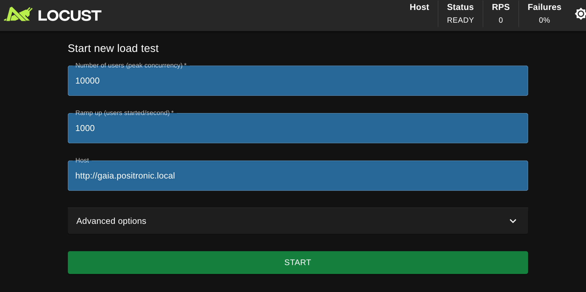
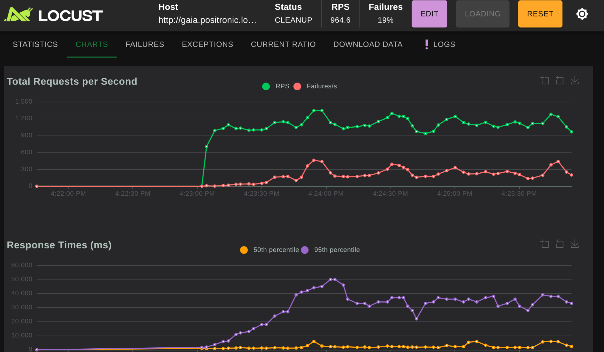

# ⚔️  El Mulo: Chaos Engineering y Pruebas de Estrés

En el universo de la *Fundación*, El Mulo es una anomalía impredecible que hace colapsar el sistema perfectamente planeado por la humanidad. En nuestro laboratorio, `el_mulo.py` es un script de **Locust** diseñado para asediar la infraestructura de Gaia y Términus hasta su punto de quiebre.

El objetivo de este directorio es establecer una **Línea Base (Baseline)** del comportamiento de la infraestructura tradicional *antes* de introducir a los agentes de IA (Precogs).

## ⚙️  Preparación del Armamento

Para aislar las dependencias y no ensuciar el host, ejecutamos Locust dentro de un entorno virtual de Python.

1. Crear y activar el entorno virtual

```bash
$ python3 -m venv venv
$ source venv/bin/activate
```

2. Instalar dependencias destructivas

```bash
$ pip install locust
```

## 🚀 Iniciando la Incursión Multiversal

Para despertar a El Mulo y levantar el centro de mando táctico en tu host local, ejecuta:

```bash
$ locust -f el_mulo.py
```

### Configuración del Ataque (Evento Nexus)

Abre tu navegador en http://localhost:8089. Para disparar las visiones de Agatha y obligar a la IA a intervenir, configura tu ejército de variantes con los siguientes parámetros:

- Number of users (peak concurrency): **10000** (Ejército de variantes)

- Ramp up (users started/second): **1000** (Tasa de invasión por segundo)

- Host: `http://gaia.positronic.local` (El universo objetivo)



Haz clic en **Start swarming** para abrir el multiverso.

## 📈 Monitoreo del Colapso

Dirígete a la pestaña **Charts** en la interfaz de Locust. En cuestión de segundos, la línea verde (Total Requests per Second) escalará agresivamente.

Cuando los recursos del clúster lleguen a su límite de estrangulamiento, la gráfica roja (_Failures/s_) comenzará a ascender sin piedad.
Nginx empezará a escupir códigos `499` y `50x`, indicando que la infraestructura está cediendo.
Es en este preciso momento de asfixia cuando nuestros agentes en `/precogs` deberán entrar en acción para salvar la realidad.



## 📊 Baseline: El Colapso de la Infraestructura Tradicional

Someter a la topología de MicroShift a una carga de 100,000 usuarios concurrentes sin autogestión inteligente arroja los siguientes resultados empíricos:

- **Fallas del Sistema**: Aproximadamente el 31% de las peticiones fallan.
- **Latencia Extrema (95th percentile)**: Los tiempos de respuesta se disparan hasta los 314,000 ms (más de 5 minutos).
- **Cuellos de Botella Físicos**: El sistema colapsa por inanición de recursos, emitiendo errores críticos de arquitectura:
    - `OSError(24, 'Too many open files')`: El host se queda sin descriptores de archivos.
    - `HTTP 502 Bad Gateway`: Nginx pierde comunicación con el backend (FastAPI).
    - `HTTP 504 Gateway Time-out`: El backend se asfixia intentando comunicarse con la base de datos Términus.
    - `HTTP 503 Service Unavailable`: Agotamiento total de los workers.

**Conclusión del Baseline**: Una arquitectura Edge estática es incapaz de sobrevivir a un pico de tráfico anómalo masivo. La intervención humana llega demasiado tarde. Se requiere observabilidad predictiva y remediación dinámica (Precogs + Multivac).
