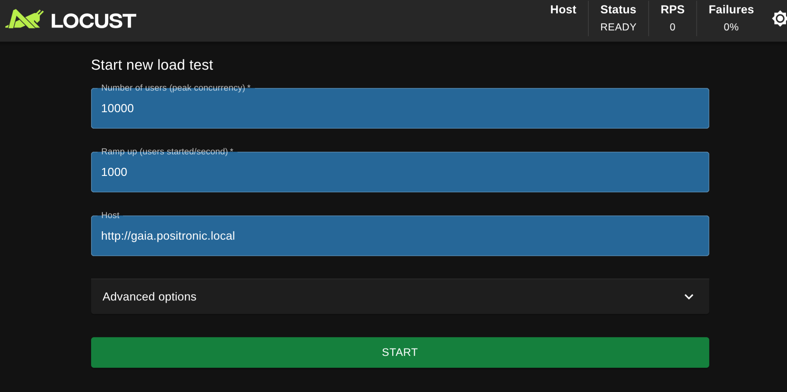
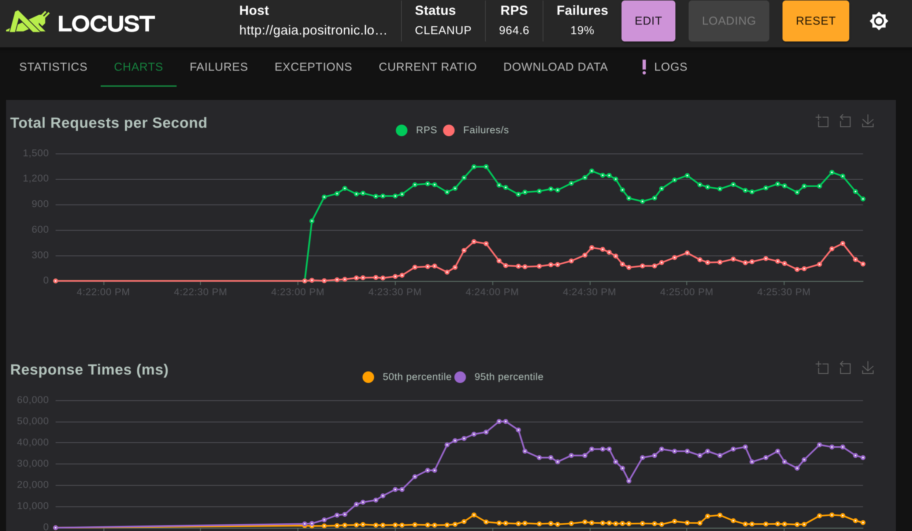

# ⚔️  El Mulo: Chaos Engineering y Pruebas de Estrés

En el universo de la *Fundación*, El Mulo es una anomalía impredecible que hace colapsar el sistema perfectamente planeado por la humanidad. En nuestro laboratorio, `el_mulo.py` es un script de **Locust** diseñado para asediar la infraestructura de Gaia y Términus hasta su punto de quiebre.

El objetivo de este directorio es establecer una **Línea Base (Baseline)** del comportamiento de la infraestructura tradicional *antes* de introducir a los agentes de IA (Precogs).

## ⚙️  Preparación del Armamento

Para aislar las dependencias y no ensuciar el host, ejecutamos Locust dentro de un entorno virtual de Python.

1. Crear y activar el entorno virtual

```bash
$ python3 -m venv venv
$ source venv/bin/activate
```

2. Instalar dependencias destructivas

```bash
$ pip install locust
```

## 🚀 Iniciando la Incursión Multiversal (Stress Total)

Para despertar a El Mulo original y levantar el centro de mando táctico en tu host local, ejecuta:

```bash
$ locust -f el_mulo.py
```

### Configuración del Ataque (Evento Nexus)

Abre tu navegador en http://localhost:8089. Para disparar las visiones de Agatha y obligar a la IA a intervenir, configura tu ejército de variantes con los siguientes parámetros:

- Number of users (peak concurrency): **10000** (Ejército de variantes)

- Ramp up (users started/second): **1000** (Tasa de invasión por segundo)

- Host: `http://gaia.positronic.local` (El universo objetivo)



Haz clic en **Start swarming** para abrir el multiverso.

## 🎭 El Mulo "Nerfeado": Chaos Controlado para Live Demos

Durante pruebas exhaustivas, descubrimos que el Mulo original es demasiado destructivo.
Generar miles de peticiones crudas no solo asfixia la red, sino que puede colapsar la CPU del equipo anfitrión y llenar el almacenamiento de logs del nodo Edge (`DiskPressure`) antes de que la IA pueda reaccionar de forma didáctica.

Para presentaciones en vivo, introducimos `el_mulo_nerfeado.py`.
Este script ejecuta un ataque quirúrgico y determinista: simula un escaneo hostil de vulnerabilidades (buscando rutas como `/api/admin/dump`) que genera errores `404` inmediatos.
Esto dispara la visión precognitiva de Agatha de forma segura, garantizando la demostración del Control Loop de AIOps sin derretir la infraestructura física.

## 🎬 Runbook de Demostración (Modo Headless)

Para la presentación, prescindimos de la interfaz gráfica y ejecutamos ráfagas cronometradas exactas desde la terminal, emitiendo alertas directas a Telegram.

**Acto 1: La Promesa de AIOps (Auto-remediación)**

Ráfaga corta de 20 segundos.
Agatha detecta los `404`, invoca a Multivac y escala el backend preventivamente a 3 réplicas.
El ataque termina durante el periodo de gracia, demostrando la estabilización autónoma (Nivel 1).

```bash
$ locust -f el_mulo_nerfeado.py --host=[http://gaia.positronic.local](http://gaia.positronic.local) --headless -u 200 -r 50 -t 20s
```

**Acto 2: El Límite de la Máquina (Escalamiento Humano)**

Ráfaga sostenida de 60 segundos.
Agatha auto-remedia y entra en su pausa táctica de 30 segundos.
Al despertar, nota que el ataque continúa.
Reconociendo sus propios límites, detiene la automatización para evitar daños colaterales y cede el control al SRE vía ChatOps para intervención manual (Nivel 2).

```bash
$ locust -f el_mulo_nerfeado.py --host=[http://gaia.positronic.local](http://gaia.positronic.local) --headless -u 200 -r 50 -t 60s
```

## 📈 Monitoreo del Colapso

Dirígete a la pestaña **Charts** en la interfaz de Locust. En cuestión de segundos, la línea verde (Total Requests per Second) escalará agresivamente.

Cuando los recursos del clúster lleguen a su límite de estrangulamiento, la gráfica roja (_Failures/s_) comenzará a ascender sin piedad.
Nginx empezará a escupir códigos `499` y `50x`, indicando que la infraestructura está cediendo.
Es en este preciso momento de asfixia cuando nuestros agentes en `/precogs` deberán entrar en acción para salvar la realidad.



## 📊 Baseline: El Colapso de la Infraestructura Tradicional

Someter a la topología de MicroShift a una carga de 100,000 usuarios concurrentes sin autogestión inteligente arroja los siguientes resultados empíricos:

- **Fallas del Sistema**: Aproximadamente el 31% de las peticiones fallan.
- **Latencia Extrema (95th percentile)**: Los tiempos de respuesta se disparan hasta los 314,000 ms (más de 5 minutos).
- **Cuellos de Botella Físicos**: El sistema colapsa por inanición de recursos, emitiendo errores críticos de arquitectura:
    - `OSError(24, 'Too many open files')`: El host se queda sin descriptores de archivos.
    - `HTTP 502 Bad Gateway`: Nginx pierde comunicación con el backend (FastAPI).
    - `HTTP 504 Gateway Time-out`: El backend se asfixia intentando comunicarse con la base de datos Términus.
    - `HTTP 503 Service Unavailable`: Agotamiento total de los workers.

**Conclusión del Baseline**: Una arquitectura Edge estática es incapaz de sobrevivir a un pico de tráfico anómalo masivo.
La intervención humana llega demasiado tarde.
Se requiere observabilidad predictiva y remediación dinámica (Precogs + Multivac).

---
👤 **Alex (@rootzilopochtli)** *Technical Training Developer en Red Hat | Miembro de Fedora Project | Autor de "Fedora Linux System Administration"*
