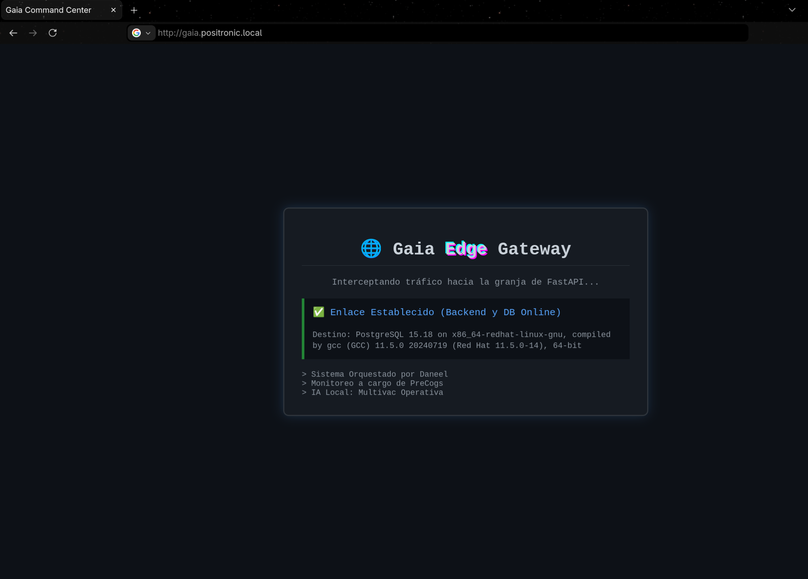
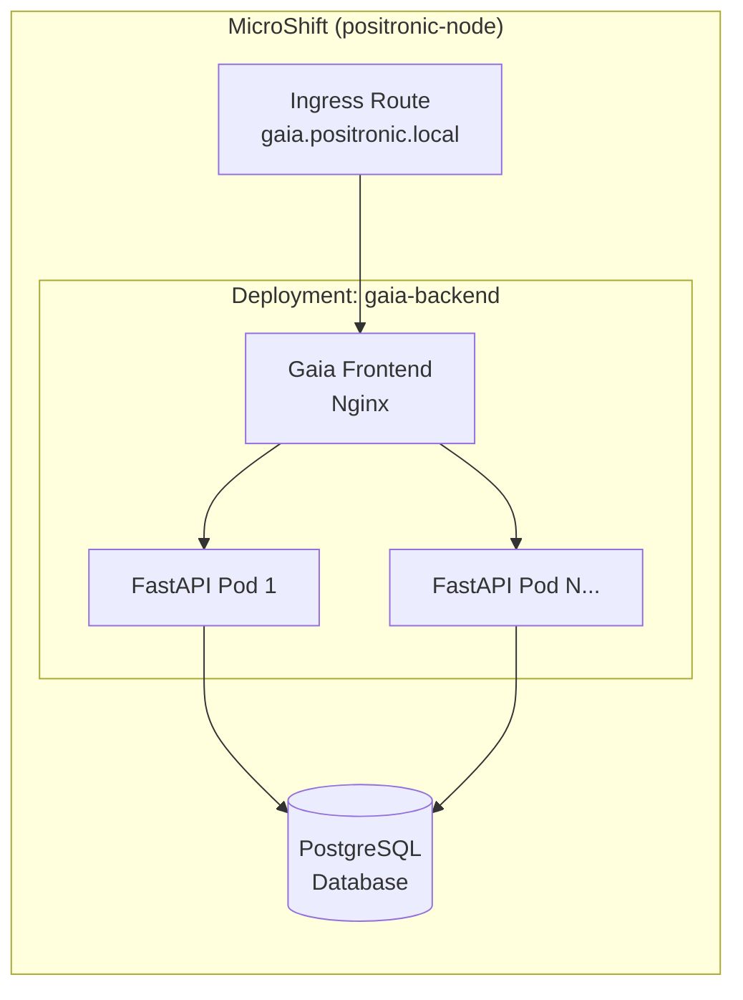

# 🪐 Magrathea: Centro de Mando y Despliegue

Al igual que la mítica constructora de planetas de Douglas Adams, este directorio contiene todos los planos (playbooks) y herramientas (scripts) necesarios para ensamblar nuestra infraestructura desde cero, guiados por el principio del 42 (el asterisco `*`, el comodín que permite crear cualquier cosa que el operador decida).

## 📋 Prerrequisitos de Construcción

Antes de ejecutar cualquier orquestación, asegúrate de tener los recursos base. Consulta nuestra documentación oficial en el directorio `docs/`:

* [Configuración de Recursos Globales de Red Hat](../docs/01-configuracion-recursos.md): Pasos para obtener tu cuenta de desarrollador, el Activation Key y el Pull Secret.
* [Creación de la Imagen Base (Golden Image)](../docs/02-creacion-imagen-base.md): Guía para generar tu imagen `.qcow2` optimizada para KVM.

## ⚙️ Instrucciones de Despliegue

El aprovisionamiento se ejecuta en fases estrictamente ordenadas. **Asegúrate de estar posicionado dentro del directorio `magrathea/` en tu terminal antes de comenzar:**

### 1. Despertar a Multivac
Este playbook descarga la imagen de Ollama, levanta el contenedor local de Podman rootless y prepara el modelo de IA base, dejándolo listo para recibir peticiones a través de una API REST.

```bash
$ ansible-playbook playbooks/01-deploy-multivac.yml
```

### 2. Aprovisionar el Hardware (KVM)

Prepara el terreno levantando la máquina virtual que albergará el nodo positrónico. **(Nota: Asegúrate de colocar tu Golden Image y tus llaves SSH dentro de este directorio `magrathea/` antes de ejecutar)**.

```bash
$ ./scripts/02-provision-daneel-kvm.sh
```

### 3. Orquestar el Nodo Positrónico

Daneel (Ansible) entra en acción para instalar y configurar MicroShift en la máquina virtual recién creada, abriendo puertos y habilitando los certificados.

```bash
$ ansible-playbook playbooks/02-deploy-daneel.yml -e "local_ip=<TU_IP> local_key=<TU_LLAVE>"
```

### 4. Desplegar la Carga de Trabajo (Gaia)

Una vez que MicroShift está operando, desplegaremos la arquitectura de 4 capas simulando un entorno *Airgap* (sin depender de registros de contenedores externos).

**Paso Cero: Construir la imagen local de la API**

*(Este paso solo se ejecuta la primera vez, o si modificas el código en `app/backend/main.py`).*

```bash
$ cd ../app/backend/
$ podman build -t localhost/gaia-backend:v1 .
$ podman save -o gaia-backend.tar localhost/gaia-backend:v1
$ cd ../../magrathea/
```

**Paso Uno: Inyectar la imagen al Nodo Positrónico**

Transferimos el artefacto al almacenamiento nativo del nodo:

```bash
$ scp -i ../labkey ../../app/backend/gaia-backend.tar positronic-user@<TU_IP>:~
$ ssh -i ../labkey positronic-user@<TU_IP> "sudo podman load -i gaia-backend.tar"
```

**Paso Dos: Levantar la topología (de adentro hacia afuera)**

```bash
$ oc apply -f manifests/gaia/01-db-postgres.yml      # Capa 4: Persistencia (Términus)
$ oc apply -f manifests/gaia/02-backend-fastapi.yml  # Capa 3: Lógica y Procesamiento (FastAPI)
$ oc apply -f manifests/gaia/03-frontend-nginx.yml   # Capa 2: Proxy Inverso y Dashboard (Nginx)
$ oc apply -f manifests/gaia/04-ingress-route.yml    # Capa 1: Enrutamiento Edge (HAProxy)
```

Al finalizar, puedes validar que el ecosistema está en perfecta sincronía navegando a `http://gaia.positronic.local` (asegúrate de que los scripts hayan inyectado la IP correctamente en tu `/etc/hosts` local).



### 5. El Retiro (Tear Down)

Cuando el laboratorio termina, Deckard se encarga de limpiar el entorno de forma segura, eliminando la máquina virtual, purgando los registros DNS locales y manteniendo el host impoluto.

```bash
$ ./scripts/04-teardown-deckard.sh
```

## 🌌 Arquitectura del Proyecto (PositronicOps)

Este laboratorio despliega la aplicación **Gaia**, una arquitectura moderna de tres capas compuesta por una base de datos PostgreSQL, un backend de API REST (FastAPI) y un frontend (Nginx) expuesto mediante Ingress. Todo el ecosistema está diseñado para operar en entornos de recursos limitados (Edge Computing) utilizando **MicroShift**.



Para asegurar la resiliencia y demostrar las capacidades de una infraestructura verdaderamente autónoma (AIOps), el proyecto se divide en módulos especializados, documentados en sus respectivos directorios:

* 💥 **[/chaos](../chaos):** Contiene a **El Mulo**, nuestro agente de estrés automatizado basado en Locust, diseñado para simular ataques DDoS y llevar al clúster a su límite operativo.
* 👁️ **[/precogs](../precogs):** Alberga nuestro sistema nervioso central de operaciones. Aquí viven **Agatha** (nuestro agente de observabilidad predictiva que caza anomalías en los logs) y **Andrew** (nuestro bot de ChatOps en Telegram), quienes trabajan en conjunto con un LLM local (Multivac) para ejecutar auto-remediación táctica sin intervención humana.

---
👤 **Alex (@rootzilopochtli)** *Technical Training Developer en Red Hat | Miembro de Fedora Project | Autor de "Fedora Linux System Administration"*
