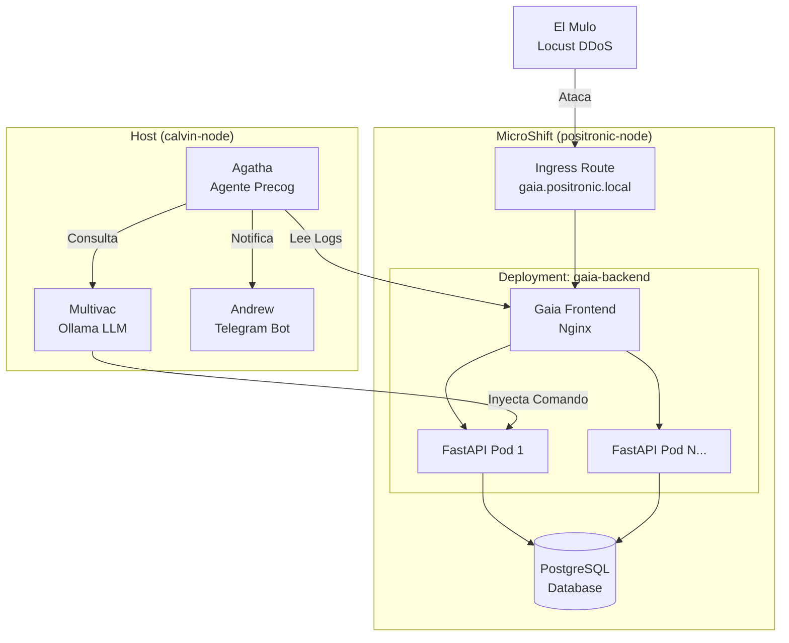

# 👁️ Precogs: Observabilidad Predictiva y AIOps

En *Minority Report* de Philip K. Dick, los "Precogs" son mutantes capaces de ver los crímenes antes de que sucedan. En nuestra arquitectura, el directorio `/precogs` es el sistema nervioso central de operaciones, diseñado para detectar el colapso de la infraestructura antes de que el usuario final lo perciba.

Aquí convergen la administración de sistemas tradicional, el Edge Computing y la Inteligencia Artificial Generativa para crear un bucle de control autónomo (Control Loop).

## 🌌 Topología de la Solución

El siguiente diagrama ilustra cómo interactúan nuestros agentes con el nodo positrónico (MicroShift) y el motor de IA (Multivac):



## 🔮 Agatha: La Precog Principal (`agatha.py`)

Agatha es un script táctico de Python que actúa como nuestra centinela. Su misión no es reportar una caída post-mortem, sino predecir el colapso.

- **Observabilidad en Tiempo Real**: Agatha se sumerge directamente en el flujo de logs del Ingress (Nginx) de la aplicación Gaia.

- **Detección de Anomalías**: Caza patrones críticos de asfixia en la red, específicamente los códigos `499` (conexiones cerradas por el cliente) y bloqueos `50x`.

- **Auto-Remediación**: Al detectar un "_Pre-Crimen_" (5 anomalías consecutivas), extrae el contexto y consulta a Multivac (nuestro LLM local). Multivac genera un comando de infraestructura (ej. `oc scale`), que Agatha limpia, valida y ejecuta contra el clúster para estabilizar el sistema sin intervención humana.

🚧 **Work In Progress (WIP)**: Agatha se encuentra en evolución continua. Actualmente estamos desarrollando una "_Matriz de Escalamiento_" donde el agente evaluará el estado actual del clúster antes de actuar, e inyectará defensas avanzadas (`Rate Limiting`) si el ataque persiste a pesar de haber alcanzado la capacidad máxima de réplicas.

## 🤖 Andrew: El Agente de ChatOps (`andrew.py`)

Bautizado en honor al robot de _El Hombre Bicentenario_ de Isaac Asimov, Andrew es el puente de comunicación directa entre la infraestructura soberana y tu dispositivo móvil.

- **Notificaciones Seguras**: Integrado de forma nativa con el motor de Agatha, Andrew despacha alertas en tiempo real a un chat privado y cifrado en Telegram.

- **Auditoría Operativa**: Andrew funciona como el _Audit Trail_ del sistema, informando el momento exacto en que se detecta una anomalía, qué comando sugirió Multivac y si la remediación inyectada en el clúster fue exitosa o fallida.

🚧 **Work In Progress (WIP)**: Actualmente Andrew es un agente de notificaciones unidireccional. El desarrollo futuro lo dotará de interactividad bidireccional pura, permitiendo al administrador solicitar métricas o ejecutar comandos de contingencia desde Telegram (ej. `/status` o `/stats`).

## 🚀 Puesta en Marcha

Nuestros agentes de inteligencia comparten las dependencias del entorno de asalto. Para iniciar la vigilancia predictiva:

1. Activa el entorno virtual:

```bash
$ cd precogs
$ source ../chaos/venv/bin/activate
```

2. Sumerge a Agatha en el tanque de visión:

```bash
$ python3 agatha.py
```

_(Nota: La matriz de comunicaciones de Andrew se inicializa automáticamente al arrancar Agatha)._

---
👤 **Alex (@rootzilopochtli)** *Technical Training Developer en Red Hat | Miembro de Fedora Project | Autor de "Fedora Linux System Administration"*
