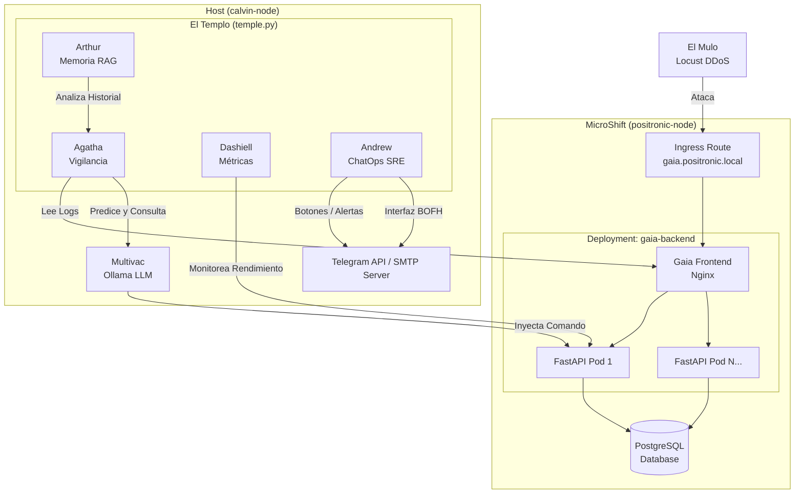

# 👁️ Precogs: Observabilidad Predictiva y AIOps

En *Minority Report* de Philip K. Dick, los "Precogs" son mutantes capaces de ver los crímenes antes de que sucedan. En nuestra arquitectura, el directorio `/precogs` es el sistema nervioso central de operaciones, diseñado para detectar el colapso de la infraestructura antes de que el usuario final lo perciba.

Aquí convergen la administración de sistemas tradicional, el Edge Computing y la Inteligencia Artificial Generativa para crear un bucle de control autónomo (Control Loop).

## 🌌 Topología de la Solución

El siguiente diagrama ilustra cómo interactúan nuestros agentes con el nodo positrónico (MicroShift) y el motor de IA (Multivac) bajo la nueva estructura centralizada:


```mermaid
graph TD
    subgraph "MicroShift (positronic-node)"
        direction TB
        I[Ingress Route<br/>gaia.positronic.local] --> F[Gaia Frontend<br/>Nginx]

        subgraph "Deployment: gaia-backend"
            F --> B1[FastAPI Pod 1]
            F --> B2[FastAPI Pod N...]
        end

        B1 --> D[(PostgreSQL<br/>Database)]
        B2 --> D
    end

    subgraph "Host (calvin-node)"
        direction TB

        subgraph "El Templo (temple.py)"
            direction LR
            AG[Agatha<br/>Vigilancia]
            AR[Arthur<br/>Memoria RAG]
            DA[Dashiell<br/>Métricas]
            AW[Andrew<br/>ChatOps SRE]
        end

        M[Multivac<br/>Ollama LLM]
        TG[Telegram API / SMTP Server]

        AG -- Lee Logs --> F
        AG -- Predice y Consulta --> M
        M -- Inyecta Comando --> B1

        AR -- Analiza Historial --> AG
        DA -- Monitorea Rendimiento --> B1

        AW -- Botones / Alertas --> TG
        AW -- Interfaz BOFH --> TG
    end

    C[El Mulo<br/>Locust DDoS] -- Ataca --> I
```

## 🏛️ Temple: El Orquestador Central (`temple.py`)

Para evitar la ejecución de scripts aislados, el ecosistema se centraliza a través de `temple.py`.
Este orquestador utiliza hilos (threading) para mantener a las distintas entidades de IA operando simultáneamente dentro de un solo proceso, actuando como el _API Gateway_ hacia Telegram.

## 🔮 Agatha: La Precog Principal (Vigilancia) `agatha.py`

Agatha actúa como nuestra centinela. Su misión no es reportar una caída post-mortem, sino predecir el colapso.

- **Observabilidad en Tiempo Real**: Se sumerge directamente en el flujo de logs del Ingress (Nginx).

- **Detección de Anomalías**: Caza patrones críticos de asfixia en la red, específicamente los códigos `499` (conexiones cerradas por el cliente) y bloqueos `50x`.

- **Matriz de Defensa SRE**:
    - **Nivel 1 (Autónomo)**: Consulta a Multivac para ejecutar comandos estabilizadores (ej. escalar réplicas) sin intervención humana.
    - **Nivel 2 (Escalamiento)**: Si el ataque (El Mulo) es de naturaleza exponencial y sobrevive a la auto-remediación, Agatha cede el control a Andrew (SRE) para contención manual (NetworkPolicies, Reinicios).

## 🧠 Arthur: El Analista Histórico (Memoria RAG) `arthur.py`

Bautizado en honor a uno de los gemelos Precog, Arthur evoluciona para convertirse en la memoria a largo plazo del clúster.

- **Inferencia RAG (`/auditoria`)**: Utiliza Generación Aumentada por Recuperación (RAG) para leer la bitácora de eventos (`precogs_audit.log`). Inyecta el contexto en Multivac (LLM) limitando tokens y temperatura para generar diagnósticos semánticos precisos en milisegundos.

- **Control Temporal**: Utiliza un sistema de marcas de tiempo determinista (`.arthur_cursor`) para garantizar que la IA solo procese anomalías nuevas, ahorrando valiosos ciclos de CPU en el Edge.


## 📈 Dashiell: El Oráculo de Rendimiento (`dashiell.py`)

El tercer hermano Precog se especializa en la infraestructura física, optimizado para el Edge Computing.

- **Estado en Vivo (`/status`)**: Consulta la API de MicroShift para renderizar un mapa visual (semáforos ASCII) con el estado de los contenedores (Gaia), reinicios y tiempos de actividad.

- **Telemetría Estética (`/perf`)**: Parsea la salida cruda del `metrics-server` de Kubernetes y la convierte en un _dashboard_ interactivo con barras de progreso de CPU y Memoria, proporcionando observabilidad de grado empresarial sin el peso de Grafana.


## 🤖 Andrew: El SRE de Trinchera (ChatOps Central)

Bautizado en honor al robot de _El Hombre Bicentenario_, de Isaac Asimov, Andrew combina una interfaz interactiva con la actitud clásica de un _Bastard Operator From Hell_ (BOFH).

- **Métricas de Seguridad Deterministas**:
    - `/resumen`: Dashboard ejecutivo global de defensas.
    - `/nivel1`: Bitácora traducida de auto-remediaciones inyectadas por Multivac.
    - `/baneados`: Muro de la vergüenza con un _Top 10_ de comandos BOFH bloqueados.

- **Intervención Táctica (Nivel 2)**: Despliega botones interactivos (In-Line) para ejecutar bloqueos de red o _rollout restarts_ con un toque.

- **Reportes Post-Mortem**: Envía informes automatizados por correo (SMTP) detallando tiempos de degradación y resoluciones aplicadas tras una crisis.

## 🚀 Puesta en Marcha

Nuestros agentes comparten dependencias del entorno de asalto. Para iniciar la vigilancia:

1. Desplegar el Metrics Server (Obligatorio para Dashiell)
> Al estar en un entorno MicroShift, requerimos el motor de métricas parcheado para TLS interno:

```bash
$ oc apply -f https://github.com/kubernetes-sigs/metrics-server/releases/latest/download/components.yaml
$ oc patch -n kube-system deployment metrics-server --type='json' -p='[{"op": "add", "path": "/spec/template/spec/containers/0/args/-", "value": "--kubelet-insecure-tls"}]'
```

2. Activar Entorno y Bóveda de Secretos

```bash
$ cd precogs
$ source ../chaos/venv/bin/activate
```
+ Asegúrate de contar con u archivo `.env` configurado con:
   * `TELEGRAM_TOKEN` y `TELEGRAM_CHAT_ID` (Para control vía ChatOps).
   * `KUBECONFIG_PATH` (Ruta al clúster MicroShift).
   * `ADMIN_EMAIL`, `SMTP_SERVER`, `SMTP_PORT`, `SMTP_USER`, y `SMTP_PASSWORD` (Para el envío de reportes Post-Mortem de Nivel 2).

3. Energiza el Templo:

```bash
$ python3 temple.py
```

---
👤 **Alex (@rootzilopochtli)** *Technical Training Developer en Red Hat | Miembro de Fedora Project | Autor de "Fedora Linux System Administration"*
