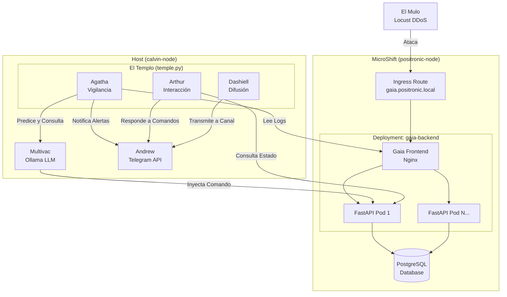

# 👁️ Precogs: Observabilidad Predictiva y AIOps

En *Minority Report* de Philip K. Dick, los "Precogs" son mutantes capaces de ver los crímenes antes de que sucedan. En nuestra arquitectura, el directorio `/precogs` es el sistema nervioso central de operaciones, diseñado para detectar el colapso de la infraestructura antes de que el usuario final lo perciba.

Aquí convergen la administración de sistemas tradicional, el Edge Computing y la Inteligencia Artificial Generativa para crear un bucle de control autónomo (Control Loop).

## 🌌 Topología de la Solución

El siguiente diagrama ilustra cómo interactúan nuestros agentes con el nodo positrónico (MicroShift) y el motor de IA (Multivac):


```mermaid
graph TD
    subgraph "MicroShift (positronic-node)"
        direction TB
        I[Ingress Route<br/>gaia.positronic.local] --> F[Gaia Frontend<br/>Nginx]

        subgraph "Deployment: gaia-backend"
            F --> B1[FastAPI Pod 1]
            F --> B2[FastAPI Pod N...]
        end

        B1 --> D[(PostgreSQL<br/>Database)]
        B2 --> D
    end

    subgraph "Host (calvin-node)"
        direction TB

        subgraph "El Templo (temple.py)"
            direction LR
            AG[Agatha<br/>Vigilancia]
            AR[Arthur<br/>Interacción]
            DA[Dashiell<br/>Difusión]
        end

        M[Multivac<br/>Ollama LLM]
        W[Andrew<br/>Telegram API]

        AG -- Lee Logs --> F
        AG -- Predice y Consulta --> M
        M -- Inyecta Comando --> B1

        AR -- Consulta Estado --> B1

        AG -- Notifica Alertas --> W
        AR -- Responde a Comandos --> W
        DA -- Transmite a Canal --> W
    end

    C[El Mulo<br/>Locust DDoS] -- Ataca --> I
```

## 🏛️ Temple: El Orquestador Central (`temple.py`)

Para evitar la ejecución de scripts aislados, el ecosistema se centraliza a través de `temple.py`.
Este orquestador utiliza hilos (`threading`) para mantener a todos los Precogs operativos simultáneamente en un solo proceso, permitiendo la vigilancia continua (background) y la interactividad (foreground).

## 🔮 Agatha: La Precog Principal (Vigilancia) `agatha.py`

Agatha actúa como nuestra centinela. Su misión no es reportar una caída post-mortem, sino predecir el colapso.

- **Observabilidad en Tiempo Real**: Se sumerge directamente en el flujo de logs del Ingress (Nginx).

- **Detección de Anomalías**: Caza patrones críticos de asfixia en la red, específicamente los códigos `499` (conexiones cerradas por el cliente) y bloqueos `50x`.

- **Auto-Remediación**: Consulta a Multivac para ejecutar comandos estabilizadores sin intervención humana.

🚧 **Work In Progress (WIP)**: Agatha se encuentra en evolución continua. Actualmente estamos desarrollando una "_Matriz de Escalamiento_" donde el agente evaluará el estado actual del clúster antes de actuar, e inyectará defensas avanzadas (`Rate Limiting`) si el ataque persiste a pesar de haber alcanzado la capacidad máxima de réplicas.

## 🧠 Arthur: El Analista (ChatOps Interactivo)

Bautizado en honor a uno de los gemelos Precog, Arthur es la interfaz bidireccional que permite auditar el clúster directamente desde Telegram sin necesidad de abrir una terminal.

- **Consultas en Tiempo Real (`/status`)**: Se conecta a la API local de MicroShift extrayendo de forma segura las credenciales (`KUBECONFIG_PATH` vía `.env`) para renderizar el estado de los Pods (Gaia) directo en tu dispositivo móvil.

- **Monitoreo de Salud (`/ping`)**: Verifica que todos los hilos del orquestador estén respirando.

- **Seguridad y Control de Acceso**: Valida estrictamente el `ADMIN_CHAT_ID`. Cuenta con múltiples rutinas de control de errores, comandos adicionales para la administración y monitoreo de la plataforma, y bloquea de forma segura (y tajante) cualquier intento de ejecución no autorizada o mala sintaxis.

🚧 **Work In Progress (WIP)**: El tercer hermano, **Dashiell (El Guardián)**, se encuentra en fase de desarrollo. Su objetivo será blindar la difusión de eventos hacia un canal público de transmisión segura.

## 🤖 Andrew: El Agente de ChatOps (`andrew.py`)

Bautizado en honor al robot de _El Hombre Bicentenario_ de Isaac Asimov, Andrew es el puente de comunicación directa entre la infraestructura soberana y tu dispositivo móvil.

- **Notificaciones Seguras**: Integrado de forma nativa con el script `temple.py`, Andrew despacha alertas en tiempo real a un chat privado y cifrado en Telegram.

- **Auditoría Operativa**: Andrew funciona como el _Audit Trail_ del sistema, informando el momento exacto en que se detecta una anomalía, qué comando sugirió Multivac y si la remediación inyectada en el clúster fue exitosa o fallida.

## 🚀 Puesta en Marcha

Nuestros agentes de inteligencia comparten las dependencias del entorno de asalto. Para iniciar la vigilancia predictiva:

1. Activa el entorno virtual:

```bash
$ cd precogs
$ source ../chaos/venv/bin/activate
```

2. Verifica tu bóveda de secretos:

   Asegúrate de contar con tu archivo oculto `.env` configurado localmente con tus variables `TELEGRAM_TOKEN`, `TELEGRAM_CHAT_ID` y `KUBECONFIG_PATH`.

3. Energiza el Templo:

```bash
$ python3 temple.py
```

_(Nota: Esto inicializará a Agatha en segundo plano y pondrá a Arthur a escuchar tus directivas)._

---
👤 **Alex (@rootzilopochtli)** *Technical Training Developer en Red Hat | Miembro de Fedora Project | Autor de "Fedora Linux System Administration"*
