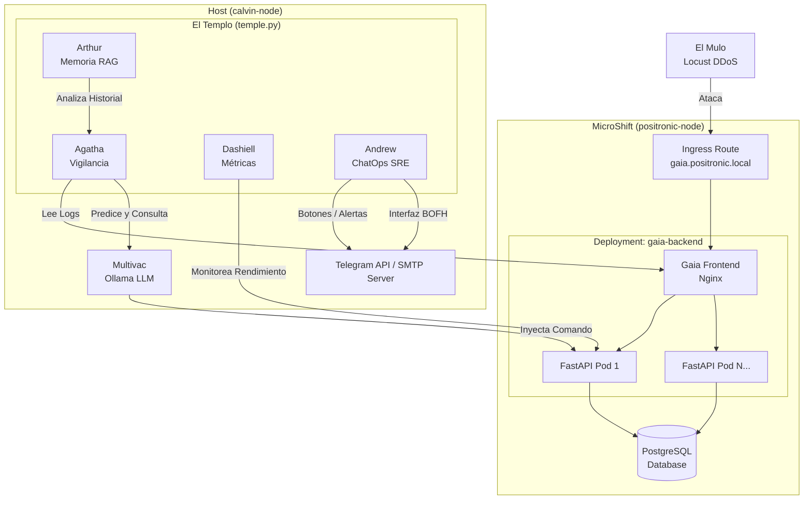

# 👁️ Precogs: Observabilidad Predictiva y AIOps

En *Minority Report* de Philip K. Dick, los "Precogs" son mutantes capaces de ver los crímenes antes de que sucedan. En nuestra arquitectura, el directorio `/precogs` es el sistema nervioso central de operaciones, diseñado para detectar el colapso de la infraestructura antes de que el usuario final lo perciba.

Aquí convergen la administración de sistemas tradicional, el Edge Computing y la Inteligencia Artificial Generativa para crear un bucle de control autónomo (Control Loop).

## 🌌 Topología de la Solución

El siguiente diagrama ilustra cómo interactúan nuestros agentes con el nodo positrónico (MicroShift) y el motor de IA (Multivac) bajo la nueva estructura centralizada:


```mermaid
graph TD
    subgraph "MicroShift (positronic-node)"
        direction TB
        I[Ingress Route<br/>gaia.positronic.local] --> F[Gaia Frontend<br/>Nginx]

        subgraph "Deployment: gaia-backend"
            F --> B1[FastAPI Pod 1]
            F --> B2[FastAPI Pod N...]
        end

        B1 --> D[(PostgreSQL<br/>Database)]
        B2 --> D
    end

    subgraph "Host (calvin-node)"
        direction TB

        subgraph "El Templo (temple.py)"
            direction LR
            AG[Agatha<br/>Vigilancia]
            AR[Arthur<br/>Memoria RAG]
            DA[Dashiell<br/>Métricas]
            AW[Andrew<br/>ChatOps SRE]
        end

        M[Multivac<br/>Ollama LLM]
        TG[Telegram API / SMTP Server]

        AG -- Lee Logs --> F
        AG -- Predice y Consulta --> M
        M -- Inyecta Comando --> B1

        AR -- Analiza Historial --> AG
        DA -- Monitorea Rendimiento --> B1

        AW -- Botones / Alertas --> TG
        AW -- Interfaz BOFH --> TG
    end

    C[El Mulo<br/>Locust DDoS] -- Ataca --> I
```

## 🏛️ Temple: El Orquestador Central (`temple.py`)

Para evitar la ejecución de scripts aislados, el ecosistema se centraliza a través de `temple.py`.
Este orquestador utiliza hilos (threading) para mantener a las distintas entidades de IA operando simultáneamente dentro de un solo proceso.

## 🔮 Agatha: La Precog Principal (Vigilancia) `agatha.py`

Agatha actúa como nuestra centinela. Su misión no es reportar una caída post-mortem, sino predecir el colapso.

- **Observabilidad en Tiempo Real**: Se sumerge directamente en el flujo de logs del Ingress (Nginx).

- **Detección de Anomalías**: Caza patrones críticos de asfixia en la red, específicamente los códigos `499` (conexiones cerradas por el cliente) y bloqueos `50x`.

- **Matriz de Defensa SRE**:
    - **Nivel 1 (Autónomo)**: Consulta a Multivac para ejecutar comandos estabilizadores (ej. escalar réplicas) sin intervención humana.
    - **Nivel 2 (Escalamiento)**: Si el ataque (El Mulo) es de naturaleza exponencial y sobrevive a la auto-remediación, Agatha detiene la ejecución autónoma y cede el control al SRE para evitar el agotamiento de recursos.

🚧 **Work In Progress (WIP)**: Agatha se encuentra en evolución continua. Actualmente estamos desarrollando una "_Matriz de Escalamiento_" donde el agente evaluará el estado actual del clúster antes de actuar, e inyectará defensas avanzadas (`Rate Limiting`) si el ataque persiste a pesar de haber alcanzado la capacidad máxima de réplicas.

## 🧠 Arthur: El Analista Histórico (WIP)

Bautizado en honor a uno de los gemelos Precog, Arthur evoluciona para convertirse en la memoria a largo plazo del clúster.

- **Consultas en Tiempo Real (`/status`)**: Se conecta a la API local de MicroShift extrayendo de forma segura las credenciales (`KUBECONFIG_PATH` vía `.env`) para renderizar el estado de los Pods (Gaia) directo en tu dispositivo móvil.

- **Aprendizaje Continuo (RAG)**: Su objetivo será procesar los resúmenes de los logs y auditar las remediaciones ejecutadas por Multivac.

- **Base de Conocimiento**: En fases posteriores, permitirá que la plataforma "aprenda" referenciando incidentes previos para evitar diagnósticos redundantes, cruzando errores actuales con el historial operativo.

## 📈 Dashiell: El Oráculo de Rendimiento (WIP)

El tercer hermano Precog se especializa en la infraestructura física y el estrés de los contenedores.

- **Monitoreo de Salud**: Vigilará las métricas de rendimiento (CPU, Memoria) de los nodos y pods de MicroShift.

- **Capacity Planning Predictivo**: Su evolución lógica será aplicar análisis predictivo sobre estas métricas para alertar si los recursos designados son suficientes para las cargas actuales, actuando como un asesor automatizado.

- **Canal de Observabilidad**: En el futuro, servirá como interfaz de "solo lectura" para que asistentes a demostraciones puedan consultar el estado del clúster sin privilegios de ejecución.

## 🤖 Andrew: El SRE de Trinchera (ChatOps Central)

Bautizado en honor al robot de _El Hombre Bicentenario_, de Isaac Asimov, Andrew ha sido asimilado completamente por el Templo.
Es tu puente de mando, combinando una interfaz interactiva con la actitud clásica de un _Bastard Operator From Hell_ (BOFH).

- **Human-in-the-Loop**: Despliega botones interactivos en Telegram cuando Agatha declara un Nivel 2, permitiendo al administrador aprobar bloqueos de IP o reinicios con un solo toque.

- **Reportes Ejecutivos (Post-Mortem)**: Tras la resolución de una crisis, documenta el tiempo de degradación y la acción tomada, enviando un informe automatizado por correo electrónico vía SMTP.

- **Seguridad BOFH**: Bloquea de forma tajante (y sarcástica) cualquier intento de ejecución no autorizada, mala sintaxis o intrusión en el sistema.

## 🚀 Puesta en Marcha

Nuestros agentes de inteligencia comparten las dependencias del entorno de asalto. Para iniciar la vigilancia predictiva:

1. Activa el entorno virtual:

```bash
$ cd precogs
$ source ../chaos/venv/bin/activate
```

2. Verifica tu bóveda de secretos:

   Asegúrate de contar con tu archivo oculto .env configurado localmente con las siguientes variables:
   * `TELEGRAM_TOKEN` y `TELEGRAM_CHAT_ID` (Para control vía ChatOps).
   * `KUBECONFIG_PATH` (Ruta al clúster MicroShift).
   * `ADMIN_EMAIL`, `SMTP_SERVER`, `SMTP_PORT`, `SMTP_USER`, y `SMTP_PASSWORD` (Para el envío de reportes Post-Mortem de Nivel 2).

3. Energiza el Templo:

```bash
$ python3 temple.py
```

---
👤 **Alex (@rootzilopochtli)** *Technical Training Developer en Red Hat | Miembro de Fedora Project | Autor de "Fedora Linux System Administration"*
